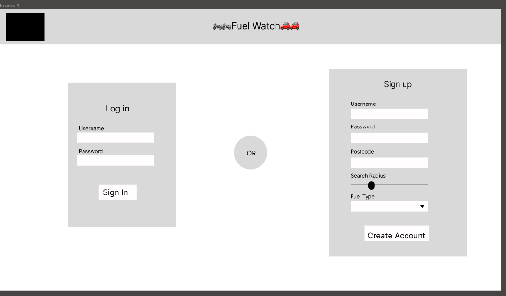
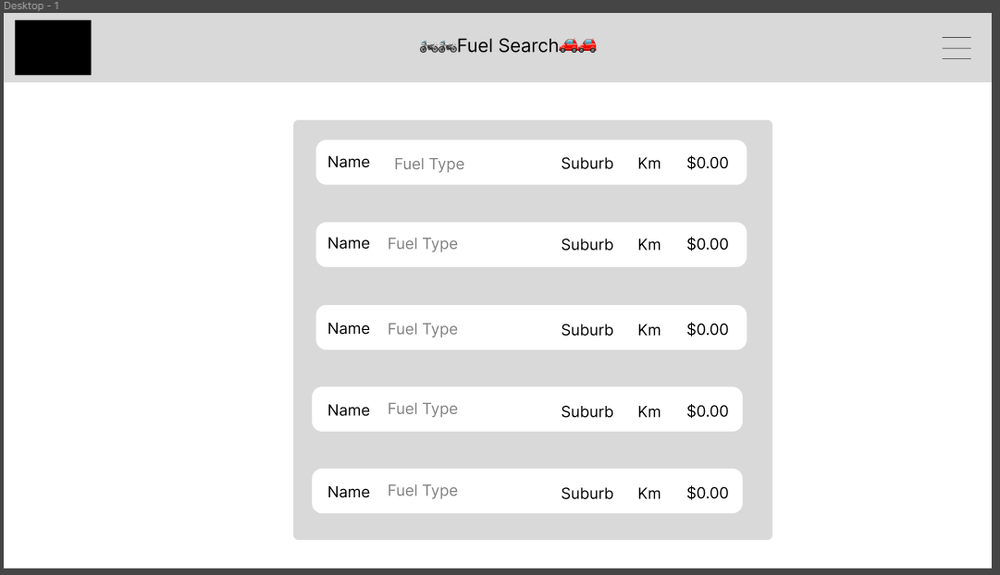
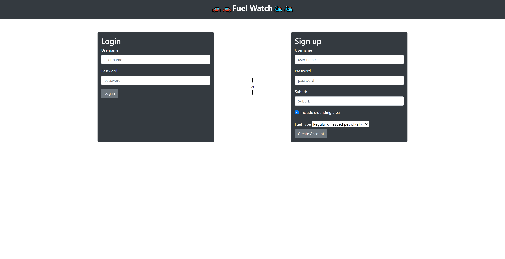

# Project 2: Fuel Watch
 
## Purpose of this app
This app will help users to find fuel stations near them with the lowest prices.
 
## User story
As a full-stack web developer,
I would like to build Fuel Watch
So that users can find fuel stations near them and compare the fuel price.
 
## How to Install and Run the Project
1. You will be required to input user name, password, suburb, tick if you include your surrounding areas and choose your preferred fuel type in the login page.
2. After signing up, you will see search results in the logged-in page.  
 
## Screen shots
 
- wireframe

 
- actual screen

<!--  -->
 
 
## Credits
 
Team MAY includes;
 
Ethan:[Github page](https://github.com/ethangodley)
 
Marissa:[Github page](https://github.com/marissakrantz)
 
Yoko:[Github page](https://github.com/Yoko-cyer)
 
## Links
 
[Github repository](https://github.com/Yoko-cyer/Project2_Fuel_Watch)
 
[Deplyed page](https://mey-project-2.herokuapp.com/)
